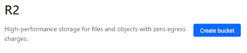
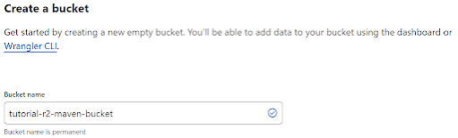
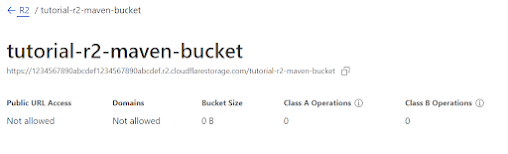
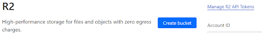
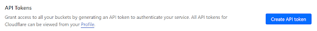
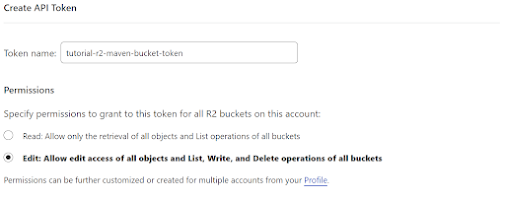
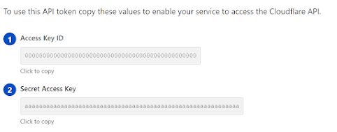

 Here's a challenge with the [public availability of the R2 Cloudflare blob storage](https://www.cloudflare.com/en-gb/press-releases/2022/cloudflare-makes-r2-storage-available-to-all/) is it possible to use it as a Maven repository with Gradle as the build system?

The short answer is yes! The longer answer is that it is, but it is a bit disappointing with Gradle, I'll explain why it's disappointing later, but first (and probably the only bit you will read) is how.

### Step 1: R2 storage

I'm assuming you have a Cloudflare account and have signed up for the R2 storage option.

1.  Navigate to the R2 Storage option on the R2 page
2.  Click 'Create bucket'

    

3.  Give the bucket a name, for the purpose of this tutorial I'm calling the bucket 'tutorial-r2-maven-bucket'

    

4.  Click create and you should have your new bucket all ready for use

    

5.  Make note of the URL for the bucket, you'll need this later

### Step 2: S3 Auth token

The secret sauce with using R2 as a maven repository is to treat it as an S3 bucket and use it's S3 compatible API. To do this you next need an S3 Auth token  for the bucket.

1.  On the R2 Overview page, click the 'Manage R2 API Tokens' link on the top right

    

2.  Select 'Create API token'

    

3.  Fill in the details by changing the token name, and setting the permissions to edit as we want to publish to this bucket.

    

4.  Once created you will be shown the 'Access Key ID' and 'Secret Access Key'. This is the only page where you will be able to see them so ensure you copy them and keep them secure.

    

### Step 3: Configuring Gradle

Now time to edit your Gradle file (I assume you have one already). There are a number of tutorials that show how to configure the `maven-publish` plugin to work with an S3 bucket, but in simple terms in the publishing section, configure the repositories as follows:

```
publishing {
    publications {
        mavenJava(MavenPublication) {
            from components.java
            artifact sourcesJar
            artifact javadocJar
        }
    }

    repositories {
        maven {
            url "s3://tutorial-r2-maven-bucket"
            credentials(AwsCredentials) {
                accessKey = "ABC...;
                secretKey = "XYZ...";
            }
        }
    }
}

```

1.  Set the 'url' field to be `s3://` followed by your bucket name for example `s3://tutorial-r2-maven-bucket`
2.  Assign the 'Access Key ID' from earlier to the `accessKey` field
3.  Assign the 'Secret Access Key' from earlier to the `secretKey` field

**IMPORTANT** You should never hard code your secrets into build files as shown above.

### Step 4: The secret sauce

The eagle eyed amongst you will have noticed that there is nothing in the configuration that tells Gradle to use your endpoint, and you would be right. The secret sauce is in the documentation about how to use the S3 API with a non AWS S3 compatible service. So you need to tell Gradle to use the URL from earlier (the one for the R2 bucket creation in Step 1.4) and unfortunately you have to do it on the command line with a `-Dorg.gradle.s3.endpoint` flag setting this to the root of the S3 bucket URL, so the command would look like:

`./gradlew publish -Dorg.gradle.s3.endpoint=https://1234abcd.r2.cloudflarestorage.com/`

If you then check the bucket you will find the published artefacts, and that is it!

### Why was this disappointing?

It's all Gradle's fault and the maven-publish plugin. It took quite a while to figure the above out mainly because the Gradle maven publish Aws S3 documentation is pretty poor and I eventually discovered what I was looking for on other website. I went down a blind alley of trying to inject in my own implementation to the publishing plugin either to override some of the limiting default behaviour, or with an idea of creating a native R2 implementation. Unfortunately the plugin is in no way extensible and has some pretty ugly limitations around hard coded assumptions between the configuration of the URL and the credentials. And that is why I came away disappointed from trying to use a tool (Gradle) that on the whole is very configurable:

- Using the AWS S3 API with an alternate endpoint is pretty poorly documented, you can find it if you know what you're looking for but it's tough
- Using a `-D` flag to signify an alternate URL is a cop out, this should be configurable as part of the DSL. This would have the side effect of improving the documentation
- It selects the implementation based on the prefix of the URL in the url field ie.g. `s3://` for an AWS S3 bucket or `https://` for an HTTP endpoint. which means it doesn't understand that the http url for an R2 bucket should actually be for an S3 compatible API, even though you have told it to use AwsCredentials
- If you use AwsCredentials with an HTTP url (or the other way round) then it just bombs out when you try to publish, not during the configuration phase
- If you do try to use HTTP then there is no way to configure an AWS compatible headers for authentication, the HttpHeader credentials only allows specifying a single header.
- You cannot change/extend the publishing implementation, nor the credentials implementation from those built in to Gradle, so as an example it's impossible to provide an R2 implementation that uses the R2 native API.
- Finding the right Gradle source code is nearly impossible, only through deliberate misconfiguration and examining stacktraces did I find it.

I should point out that Cloudflare's documentation is spot on and wasn't the cause of my frustration.
